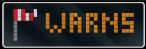

# Home Assistant

|Blueprint|Description|Import|Preview|
|-----------|-----------|-------|----|
| AWTRIX DWD Weather Warnings ⛈️ | Blueprint for showing weather warnings issued by DWD[^1] | [](https://my.home-assistant.io/redirect/blueprint_import/?blueprint_url=https%3A%2F%2Fraw.githubusercontent.com%2Fjc-23%2Fhome-assistant%2Fmaster%2Fblueprints%2Fautomation%2Fawtrix_weather_warning_dwd.yaml) | 

# Getting the Icons

```bash
# If you run this script it will help upload icons to your AWTRIX device
bash -c "$(curl -fsSL https://raw.githubusercontent.com/jc-23/home-assistant/master/icons/upload_icon.sh)"

# Or you can run 
bash -c "$(curl -fsSL https://raw.githubusercontent.com/jc-23/home-assistant/master/icons/upload_icon.sh)" -- IP_ADDRESS_OF_CLOCK
```

[^1]: Credits go to [Jeef](https://github.com/jeeftor) and his [AWTRIX Weather ⛈️ + Forecast + \U0001F315️](https://raw.githubusercontent.com/jeeftor/HomeAssistant/master/blueprints/automation/awtrix_weatherflow.yaml) blueprint on which this blueprint is based.

<https://my.home-assistant.io/create-link/?redirect=blueprint_import>
